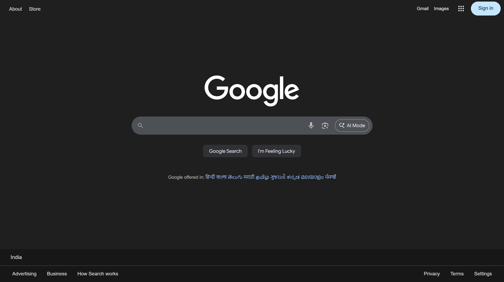

  

<h1 align="center">🎨✨ Google Homepage Redesign — neumorphic design UI Theme (React + Vite + Tailwind)</h1>

  Modern • Minimal • Installable • Cross-Platform • PWA Ready

  
  
  

---

## 🌟 Overview  
This project is a **premium redesign** of the Google homepage—built using **React + Vite + Tailwind CSS** for maximum speed, modern UI styling, and clean component structure.

Designed as part of my journey as a **Full-Stack Developer expanding into UI/UX** to create more polished, modern, user-focused interfaces.

You can also **install it as a desktop app (PWA)** on Windows and macOS — complete with a custom icon.

> ⭐ If you like this project, PLEASE **star the repo** — it helps this project grow!

---

## 📸 Before & After Preview

### 🔵 Original Google Homepage

### 🟣 Premium Redesigned Homepage

---

## 🚀 Live Demo  
👉 **Open Theme:** https://googlethemes.vercel.app  

Best viewed in **Google Chrome**.

---

## 🧩 How to Install This as an App (PWA)

This theme behaves like a **native desktop app** after installation.

### Supported On:
- ✔ Windows  
- ✔ macOS  
- ✔ ChromeOS  
- ✔ Any device running Chrome  

---

# 📥 Installation Steps (Windows & macOS)

### **1️⃣ Open the website**  
Open the live link in **Google Chrome**.

### **2️⃣ Click the Chrome menu (⋮)**  
Top-right corner of the browser.

### **3️⃣ Select install option:**  
Depending on Chrome version:

- **Install App…**  
- **Save & Share → Install**  
- **Create shortcut… → Open as window**

### **4️⃣ Give it a name**  
Example: **Google Theme Premium**

### **5️⃣ Install**  
Chrome creates:
- Desktop icon  
- Start Menu / Launchpad app  
- Standalone window  

🎉 Your Premium Google Theme is now installed like a real app!

---

## 📌 Optional: Pin to Taskbar / Dock

### 🖥️ Windows  
- Search “**Google Theme**”  
- Right-click → **Pin to Taskbar**

### 🍎 macOS  
- Open the installed app  
- Right-click in Dock → **Keep in Dock**

---

## 💠 Features

| Feature | Status |
|--------|--------|
| 🎨 Premium modern UI | ✔ |
| ⚛️ Built with React | ✔ |
| ⚡ Powered by Vite | ✔ |
| 💎 Styled using Tailwind CSS | ✔ |
| 📱 Installable PWA | ✔ |
| 🖥️ Windows & macOS support | ✔ |
| 🚀 Ultra-fast loading | ✔ |
| 🔧 Clean component structure | ✔ |

---

## 🛠 Tech Stack  
- ⚛️ **React**  
- ⚡ **Vite**  
- 🎨 **Tailwind CSS**  
- 📦 **PWA Integration**  
- 🌐 **Hosted on GitHub Pages / Netlify / Vercel**  

---

## ⭐ Support This Project  
If you like what you see:

### 👉 PLEASE **star the repository** — it really helps!

You can also:
- Open issues  
- Suggest improvements  
- Share the project  
- Connect with me  

---

## 📬 Connect With Me  
💼 LinkedIn: *https://www.linkedin.com/in/codewithkinu*  
🐙 GitHub: *https://www.github.com/sahilmd01*  
📧 Email: *sahilmd.dev@gmail.com*

---

<h3 align="center">✨ Thank you for exploring my Google redesign — built with React, Vite & Tailwind ✨</h3>
